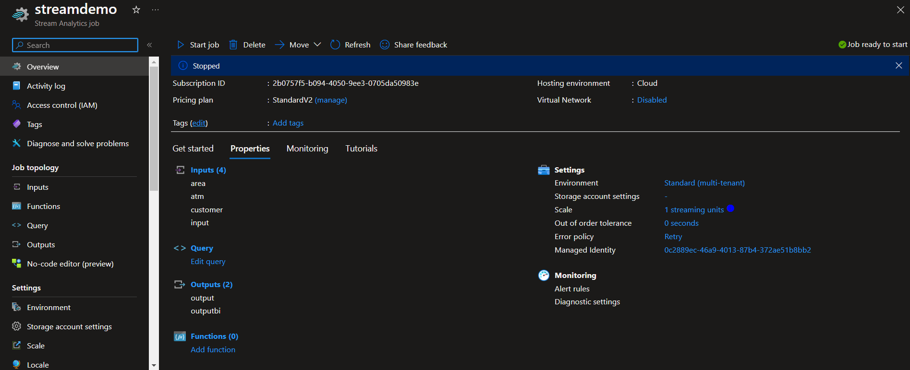
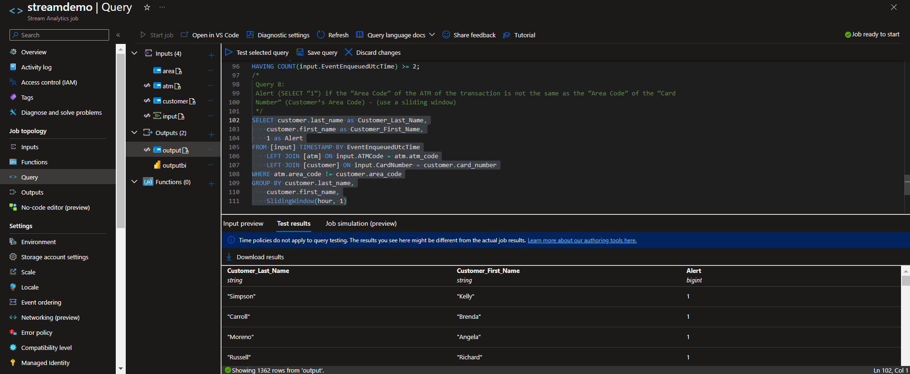

# azure-stream-analytics
Project #3 in Big Data Systems Management

# Contents
- [Contents](#Contents)
- [Authors](#Authors)
- [Purpose](#Purpose)
- [Setup of Azure](#Setup_of_Azure)

# Authors
> Konstantinos Riganas, Student 
> Department of Management Science and Technology  
> Athens University of Economics and Business  
> t8200145@aueb.gr

> Nikolaos Nikolaidis, Student 
> Department of Management Science and Technology  
> Athens University of Economics and Business  
> t8200120@aueb.gr

# Purpose
<h3>Process a Data Stream of ATM transactions</h3>

- **Query 1:** Show the total “Amount” of “Type = 0” transactions at “ATM Code = 21” of the last 10 minutes. Repeat as new events
 keep flowing in (use a sliding window).

- **Query 2:** Show the total “Amount” of “Type = 1” transactions at “ATM Code = 21” of the last hour. Repeat once every hour
 (use a tumbling window).

- **Query 3:** Show the total “Amount” of “Type = 1” transactions at “ATM Code = 21” of the last hour. Repeat once every 30 minutes
 (use a hopping window).

- **Query 4:** Show the total “Amount” of “Type = 1” transactions per “ATM Code” of the last one hour (use a sliding window).

- **Query 5:** Show the total “Amount” of “Type = 1” transactions per “Area Code” of the last hour. Repeat once every hour (use a
 tumbling window)

- **Query 6:** Show the total “Amount” per ATM’s “City” and Customer’s “Gender” of the last hour. Repeat once every hour (use a tumbling window).

- **Query 7:** Alert (SELECT “1”) if a Customer has performed two transactions of “Type = 1” in a window of an hour (use a sliding
 window)

- **Query 8:** Alert (SELECT “1”) if the “Area Code” of the ATM of the transaction is not the same as the “Area Code” of the “Card
 Number” (Customer’s Area Code) - (use a sliding window)

# Setup of Azure

**Stream Demo Overview**

**Running Query 8**
